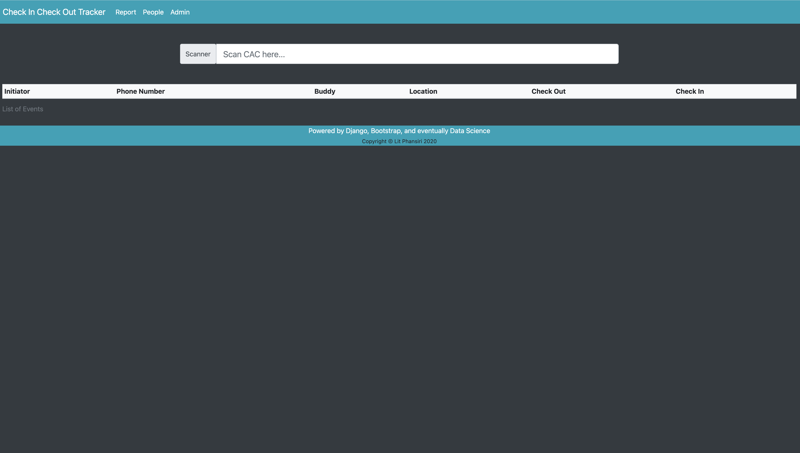

# Simple Check In Check Out System

Marine Corps barracks still uses paper logbooks to check in / out Marines who want to go on liberty on or off base.
This is a simple docker django application that works with a scanner that reads in a military Common Access Card and
helps automate the process of checking in and out without the need of the Marine on duty to fill out a single physical
logbook. This is meant to run on a local machine.




## Future features
- [ ] Use Data Science Pandas for simple metrics evaluation for Reports tab
- [ ] Connect to Github Actions
- [ ] Convert to backend (Django API) and frontend (React) Single Page Application


## Getting Started

`docker-compose up --build`
These instructions will get you a copy of the project up and running on your local machine for development and testing purposes. See deployment for notes on how to deploy the project on a live system.


### Prerequisites

1. Docker: [Get Docker](https://docs.docker.com/get-docker/)
1. Python: [Get Python](https://www.python.org/downloads/)


### Installing

1. Install Docker and Python
1. Download this repository
```bash
git clone https://github.com/phansiri/check_in_check_out_bks.git
```
1. Create an `.env` file inside the `cico_project` directory that contains the below example:
```dotenv
DJ_DEBUG=True
DJ_SECRET_KEY=super_secret_key
DJ_ALLOWED_HOSTS=localhost 127.0.0.1 [::1] 0.0.0.0
SQL_ENGINE=django.db.backends.postgresql
SQL_DATABASE=cat_database_name
SQL_USER=super_cool_user
SQL_PASSWORD=super_secret_password
SQL_HOST=db
SQL_PORT=5432
```
1. Create an `.env.db` file inside the `cico_project` for the environment variables to create the database inside the postgres image.
```dotenv
POSTGRES_DB=cat_database_name
POSTGRES_USER=super_cool_user
POSTGRES_PASSWORD=super_secret_password
```
1. Ensure the information for the databases are the same between the `.env` and `.env.db`
1. In the root of the repo on the command line, type `docker-compose up --build`
1. You will notice that your database will probably not exist
   1. Run: `docker-compose down -v` This will removed the persistent stored volume
   1. Run `docker-compose up --build` and it ought to apply.
   1. In a different terminal, run to ensure models are in the database:
   1. `docker-compose exec web python manage.py migrate`
      * If it asks you to make migrations first, run:
         * `docker-compose exec web python manage.py makemigrations`

1. Open [http://localhost:8000](http://localhost:8000)
A step by step series of examples that tell you how to get a development env running
   

## Running the tests

1. To run tests, ensure the docker-compose is up with
   * `docker-compose up`
1. After it is up and running, open another terminal and run:
   * `docker-compose exec web python manage.py test`
1. In order to see the admin backend, a super user must be created by running:
   * `docker-compose exec web python manage.py createsuperuser`


## Built With

* [Bootstrap](https://getbootstrap.com/) - Front-end open source toolkit
* [Django](https://www.djangoproject.com/) - High-level Python Web framework
* [Docker](https://docs.docker.com/) - Containerization  


## Acknowledgments

* [Django Docker Start](https://docs.docker.com/compose/django/)
* [Django Girls Tutorial](https://tutorial.djangogirls.org/en/)
* [Django, Postgress, Gunicorn, and Ngnix steps](https://testdriven.io/blog/dockerizing-django-with-postgres-gunicorn-and-nginx/)
* [Django with Env](https://medium.com/swlh/setting-up-a-secure-django-project-repository-with-docker-and-django-environ-4af72ce037f0)


## Useful commands or recommendations
* `docker-compose exec web python manage.py startapp cico_app`
* `docker-compose exec web python manage.py test --parallel`
* `docker-compose exec web python manage.py createsuperuser`
* `docker-compose exec web python manage.py makemigrations`
* `docker-compose exec web python manage.py migrate`
* `docker-compose exec web python manage.py check --deploy`
* `docker-compose up --build`
* `docker-compose down`
* Entrypoint.sh must be executable: `chmod +x entrypoint.sh`

